# AI Async Processing API

A production-style mini backend for asynchronous LLM processing using FastAPI and Redis.

## Features

- `POST /jobs` to enqueue prompt processing
- `GET /jobs/{job_id}` to fetch job status/result
- Redis-backed queue with background worker (`BLPOP`)
- Redis cache to avoid duplicate LLM calls
- API key auth via request header
- Redis-backed fixed-window rate limiting
- Works with OpenAI API or mock responses (if no API key is set)

## Project Structure

```
app/
  config.py
  llm.py
  main.py
  models.py
  redis_client.py
worker.py
docker-compose.yml
requirements.txt
```

## Run Locally (without Docker)

1. Create and activate venv
2. Install dependencies:

```bash
pip install -r requirements.txt
```

3. Copy env file:

```bash
cp .env.example .env
```

4. Start API:

```bash
uvicorn app.main:app --reload
```

5. Start worker (new terminal):

```bash
python worker.py
```

## Run with Docker Compose

```bash
cp .env.example .env
docker compose up --build
```

## API Usage

Create a job:

```bash
curl -X POST http://localhost:8000/jobs \
  -H "X-API-Key: dev-key-1" \
  -H "Content-Type: application/json" \
  -d '{"prompt":"Explain Redis queues in 3 lines"}'
```

Check status:

```bash
curl -H "X-API-Key: dev-key-1" http://localhost:8000/jobs/<job_id>
```

Queue depth metric:

```bash
curl -H "X-API-Key: dev-key-1" http://localhost:8000/metrics
```

## Auth and Rate Limiting

- Protected routes: `POST /jobs`, `GET /jobs/{job_id}`, `GET /metrics`
- Public route: `GET /health`
- API key header name is configurable with `API_KEY_HEADER_NAME` (default `X-API-Key`)
- Allowed keys are configured through `API_KEYS` as comma-separated values
- To disable auth (local experiments), set `AUTH_REQUIRED=false`
- Rate limiting is Redis-backed and keyed by `<api_key>:<client_ip>`
- Defaults: `30` requests per `60` seconds
- Configure using:
  - `RATE_LIMIT_ENABLED`
  - `RATE_LIMIT_REQUESTS`
  - `RATE_LIMIT_WINDOW_SECONDS`
  - `RATE_LIMIT_KEY_PREFIX`

## Notes

- If `OPENAI_API_KEY` is empty, the worker returns deterministic mock text (`MOCK_RESPONSE: ...`).
- Set `OPENAI_API_KEY` in `.env` to use real OpenAI completions.

## Architecture (Portfolio Section)

### Sequence Diagram

```mermaid
sequenceDiagram
    participant C as Client
    participant A as FastAPI
    participant R as Redis
    participant W as Worker
    participant O as OpenAI

    C->>A: POST /jobs {prompt}
    A->>R: GET cache key (model+prompt hash)
    alt Cache hit
        R-->>A: cached result
        A->>R: HSET job status=completed
        A-->>C: 202 {job_id, status=completed, cached=true}
    else Cache miss
        A->>R: HSET job status=queued
        A->>R: RPUSH queue job_id
        A-->>C: 202 {job_id, status=queued, cached=false}
        W->>R: BLPOP queue
        R-->>W: job_id
        W->>R: HSET status=processing
        W->>O: Generate completion(prompt)
        O-->>W: response text
        W->>R: SET cache key (TTL)
        W->>R: HSET status=completed,result
        C->>A: GET /jobs/{job_id}
        A->>R: HGETALL job key
        A-->>C: 200 {status,result}
    end
```



### Redis Key Map

- Queue list:
  - key: `llm:jobs:queue` (from `QUEUE_NAME`)
  - type: `List`
  - values: `job_id` strings
- Job record:
  - key: `llm:job:<job_id>` (from `JOB_KEY_PREFIX`)
  - type: `Hash`
  - fields: `job_id`, `status`, `prompt`, `result`, `error`, `created_at`, `updated_at`
- LLM cache:
  - key: `llm:cache:<sha256(model:prompt)>` (from `CACHE_KEY_PREFIX`)
  - type: `String`
  - value: model output text
  - TTL: `CACHE_TTL_SECONDS`
- Rate limit counter:
  - key: `llm:ratelimit:<api_key>:<client_ip>` (from `RATE_LIMIT_KEY_PREFIX`)
  - type: `String` counter
  - TTL: `RATE_LIMIT_WINDOW_SECONDS`

### Request/Response Examples

Create job:

```http
POST /jobs HTTP/1.1
Host: localhost:8000
X-API-Key: dev-key-1
Content-Type: application/json

{
  "prompt": "Explain Redis queue in 3 bullets"
}
```

Create job response (queued):

```json
{
  "job_id": "8f5ac7de-5f90-48f0-a96a-4e4d8f59526f",
  "status": "queued",
  "cached": false
}
```

Create job response (cache hit):

```json
{
  "job_id": "6a35dd40-42a8-4f2d-bbfc-703f03aa9f71",
  "status": "completed",
  "cached": true
}
```

Poll job:

```http
GET /jobs/8f5ac7de-5f90-48f0-a96a-4e4d8f59526f HTTP/1.1
Host: localhost:8000
X-API-Key: dev-key-1
```

Poll response (processing):

```json
{
  "job_id": "8f5ac7de-5f90-48f0-a96a-4e4d8f59526f",
  "status": "processing",
  "prompt": "Explain Redis queue in 3 bullets",
  "result": null,
  "error": null,
  "created_at": "2026-04-16T12:02:01.123456+00:00",
  "updated_at": "2026-04-16T12:02:02.083000+00:00"
}
```

Poll response (completed):

```json
{
  "job_id": "8f5ac7de-5f90-48f0-a96a-4e4d8f59526f",
  "status": "completed",
  "prompt": "Explain Redis queue in 3 bullets",
  "result": "- Redis list stores pending jobs\\n- Worker consumes with BLPOP\\n- API stays fast by returning job_id",
  "error": null,
  "created_at": "2026-04-16T12:02:01.123456+00:00",
  "updated_at": "2026-04-16T12:02:03.912345+00:00"
}
```
